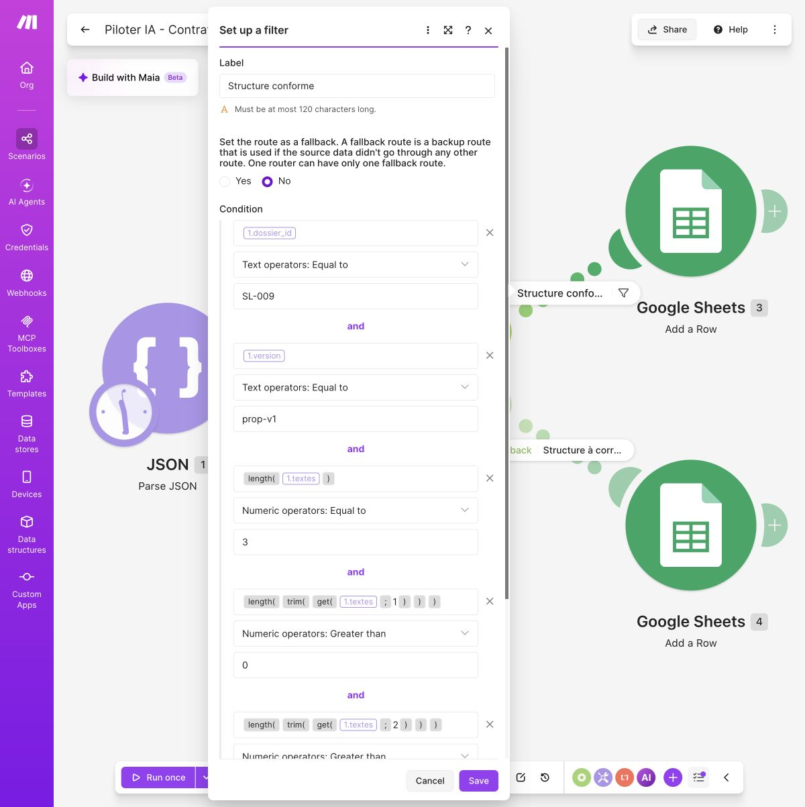
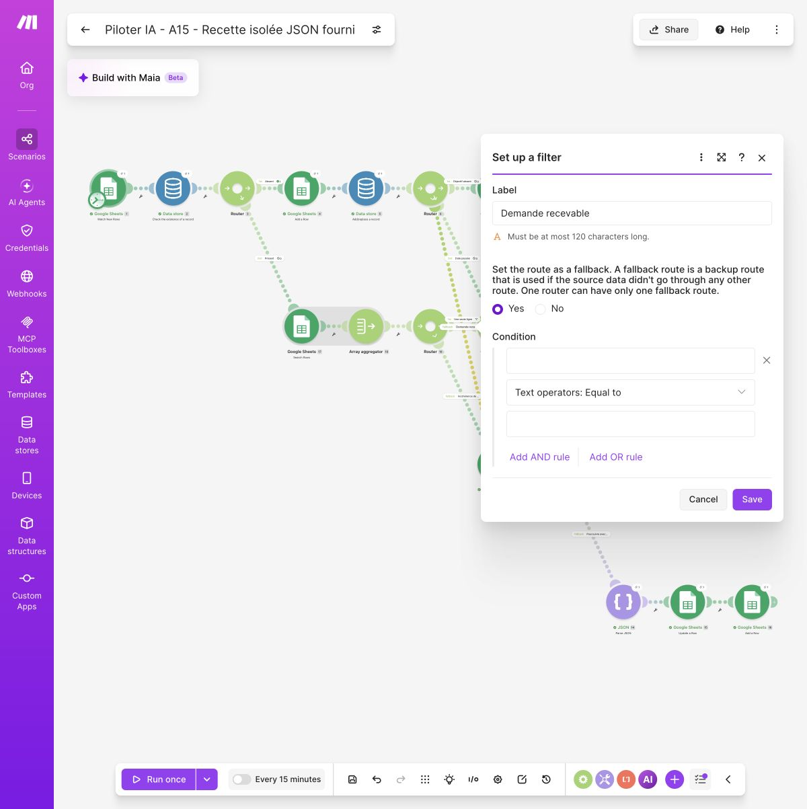

# Ressource compagnon — édition 2026, révision 0.15

Procédure synchronisée avec le chapitre 5 du livre. Les neuf événements et reprises utilisent le JSON fourni ; un passage supplémentaire avec Simple text prompt a réellement généré puis enregistré une proposition, suivi d’un accord fictif et d’un brouillon Gmail. Aucun courriel envoyé. Voir SCENARIO_A_VERIFICATION.md pour le périmètre exact.

# 05 - Assembler le circuit, de la demande à la relecture

Nous allons réunir les gestes des chapitres précédents. Dans les ressources du tome, ASSEMBLER_SCENARIO_A.md reprend les étapes et LABORATOIRE_JSON.md permet de revoir le petit essai sans connexion externe. Ils complètent les explications présentes ici.

Les six paliers ci-dessous sont des points d’arrêt, pas six tâches à terminer d’un seul coup. Gardez une copie après chaque résultat vérifié. À la fin, une demande fictive complète doit posséder une seule ligne de suivi, un dossier Drive et une proposition A_RELIRE. Une demande sans objectif doit s’arrêter avec une explication. Une répétition identique ne doit pas provoquer un second appel au modèle. Le scénario B du chapitre 6 préparera le brouillon seulement après une décision humaine.

## Préparer une petite installation dont on comprend les limites

Gardez la planification désactivée. Exécutez un événement à la fois et n’autorisez personne à modifier Dossiers pendant un essai. Le laboratoire n’est pas un service multi-utilisateur : deux exécutions concurrentes pourraient franchir les mêmes contrôles. Son intérêt est de rendre chaque décision visible avant d’apprendre à renforcer ces garanties.

Dans un nouveau classeur de test, créez trois feuilles. **Entrees** contient les événements de l’annexe, **Dossiers** contient l’état courant et **Journal** conserve le résultat de chaque passage. N’effacez pas les essais précédents dans votre classeur personnel : repartez d’une nouvelle copie nommée « Studio Local - scénario A ».

Dans Entrees, utilisez ces en-têtes exacts, dans cet ordre : event_id, dossier_id, commerce, objectif, faits, inconnus, date_souhaitee, note. Pour le premier essai, ne saisissez que E-001. Le champ date_souhaitee est vide ou au format année-mois-jour, par exemple 2026-10-15. La note reste une pièce d’entrée : elle ne sera pas transmise au modèle.

Dans Dossiers, créez les colonnes dossier_id, commerce, objectif, faits, inconnus, date_souhaitee, statut, motif, drive_folder_id, version_proposition, texte_brouillon, manques, decision, version_approuvee, approbateur, date_accord et gmail_draft_id. Laissez les lignes de données vides. Dans Journal, créez event_id, dossier_id, etape, resultat, motif et heure. Tous ces champs sont des textes pour cet atelier, sauf l’heure de suivi dont vous pouvez choisir l’affichage dans Sheets.

Le formulaire du chapitre 2 reste une autre porte d’entrée. Pour les essais, la feuille Entrees permet notamment une ligne vide que Forms refuserait. Après les tests, faites pointer le déclencheur vers la feuille de réponses du formulaire et remappez chaque question vers son champ. Ajoutez alors les questions « Référence de soumission » pour event_id, « Date souhaitée » pour date_souhaitee et « Note » pour note. La référence unique est fournie par l’opérateur de test ; la date reste facultative et respecte le format année-mois-jour. Remappez ces trois réponses dans le scénario. Ne faites pas passer cette convention de laboratoire pour une génération fiable d’identifiants en production.

Le champ event_id appartient à Entrees et Journal : il identifie un passage. Il ne figure pas dans les dix-sept colonnes de Dossiers, qui conservent l’état courant d’un même dossier.

## Rendre l’absence observable avant de chercher une ligne

Une recherche Sheets vide peut ne produire aucun paquet. Ajouter un routeur après elle ne fait pas renaître ce paquet. Pour ne pas dépendre d’une option implicite, notre montage utilise un petit **index** dans Make : une liste des identifiants dont la ligne a déjà été créée. L’index ne contient ni brief ni décision ; Sheets reste la référence du dossier.

Dans Make, ouvrez Data stores et créez « SL - index laboratoire », avec un champ texte `repere`. Réservez-lui l’espace minimal proposé compatible avec votre offre. Il doit être vide, comme Dossiers. La clé de chaque entrée sera le dossier_id. La documentation de Make décrit **Check the Existence of a Record** : ce module retourne un résultat de présence même quand la clé n’existe pas. C’est précisément la différence avec une recherche sans résultat. Référence : https://help.make.com/l6du-data-stores.

Pourquoi accepter cette petite complication ? Elle donne au lecteur un embranchement explicite « existe / n’existe pas ». En contrepartie, il faut maintenir l’index et la feuille ensemble. Si vous importez des dossiers existants, préparez leurs clés avant l’essai. Si une panne survient entre la création de ligne et l’ajout de clé, arrêtez et réconciliez les deux. Un second registre n’élimine pas les pannes ; il rend notre choix de routage contrôlable.

### Choisir où chercher un dossier

L’index de cet atelier est un choix de conception, pas une obligation pour toutes les activités. Il rend le résultat « absent » observable avant la recherche Sheets, mais ajoute un registre à maintenir. Comparez les solutions avant de multiplier les outils.

| Solution | Ce qu’elle apporte | Limite à traiter | Quand la choisir |
| --- | --- | --- | --- |
| Recherche Sheets seule | Une référence unique, facile à relire | Zéro résultat peut ne produire aucun paquet ; gérer explicitement ce cas et les doublons | Petit circuit manuel ou outil qui sait produire un résultat vide explicite |
| Index Make et Sheets | Présence booléenne puis contrôle de la ligne ; branches faciles à observer | Une panne peut désynchroniser clé et ligne ; réconciliation nécessaire | Laboratoire séquentiel du livre, avec un opérateur et un journal |
| Base de données avec contrainte d’unicité | Identifiant unique imposé et écritures transactionnelles possibles | Configuration, sauvegarde et droits plus techniques | Plusieurs utilisateurs ou créations concurrentes ; besoin de garanties plus fortes |

Limiter Search Rows à un résultat n’est pas un traitement des doublons : cela les cache. Notre limite de deux permet de refuser une ambiguïté. En production, la règle d’unicité doit être imposée par le système de référence ; une convention de nommage seule ne remplace pas cette protection.

## Assembler par petites preuves, pas par un grand dessin

Un scénario visuel peut donner une impression trompeuse de simplicité : on ajoute une bulle, puis une autre, jusqu’à ne plus savoir quelle étape a introduit le défaut. Pour éviter cette accumulation, construisez le circuit en paliers que l’on peut expliquer et tester séparément. Enregistrez une copie reconnaissable à chaque palier réellement vérifié, avec une phrase indiquant ce qui reste absent.

Commencez par le déclencheur seul. Observez E-001 dans sa sortie et vérifiez les noms des champs. N’ajoutez pas encore Drive. Ajoutez ensuite le contrôle d’existence et les branches. Leur premier objectif est de distinguer « nouvelle demande », « répétition » et « incohérence », pas de produire un texte. Une fois ce comportement compris, ajoutez la vérification de l’objectif, puis celle de la date. La création du dossier documentaire vient seulement après ces arrêts.

Avant chaque exécution, faites une prédiction concrète : « Une ligne SL-002 va être créée, puis marquée A_COMPLETER ; aucun dossier Drive ne doit apparaître. » Après l’exécution, contrôlez la ligne et l’absence d’objet externe. La prédiction oblige à relier le dessin à un effet observable. Elle révèle souvent une confusion avant même qu’elle ne produise une erreur.

### Lire une route qui ne reçoit rien

Trois situations se ressemblent à l’écran mais appellent des diagnostics différents. Le déclencheur peut n’avoir trouvé aucune nouvelle ligne. Une recherche peut avoir produit zéro résultat. Un filtre peut avoir reçu une donnée puis l’avoir refusée. Dans le premier cas, contrôlez le point de départ et la nouvelle ligne ; dans le deuxième, inspectez la recherche ; dans le troisième, comparez les deux valeurs de la condition. Ne commencez pas par reconnecter tous les comptes.

Un petit journal explicite devient utile lorsque ces arrêts font partie du processus. Pour Léa, une demande incomplète doit rester visible avec son motif. Elle ne doit pas simplement disparaître parce qu’un filtre ne laisse rien passer. C’est la différence entre un arrêt technique et un traitement professionnel compréhensible.

### Ne pas confondre plusieurs conditions avec plusieurs routes

À l’intérieur d’un filtre, ET signifie que toutes les conditions doivent être vraies ; OU qu’au moins une suffit. Plusieurs routes peuvent chacune avoir un filtre vrai. Dessiner deux branches ne crée donc pas automatiquement un choix exclusif. Dans notre circuit, les routes doivent être conçues pour ne pas produire deux actions incompatibles sur la même demande.

Prenons une version prop-v2 approuvée dans le registre, mais une version prop-v3 dans la proposition courante. Les conditions « décision égale à APPROUVE » et « versions identiques » doivent être liées par ET avant le brouillon. Les relier par OU ferait passer le dossier malgré l’accord périmé. Pour tester ce défaut, changez seulement la version de la proposition et vérifiez l’arrêt. Ne vous contentez pas du cas où toutes les cases sont favorables.

### Une copie de scénario n’est pas une deuxième activité prête à lancer

Dupliquer un scénario facilite la préparation d’une variante. Cela peut aussi conserver le mauvais classeur, le mauvais dossier parent ou une adresse de test. Après duplication, contrôlez les références une par une. Les connexions autorisent l’accès ; les champs de chaque module déterminent ce qui sera visé. Ces deux couches doivent être vérifiées.

Un blueprint est un fichier décrivant des modules, paramètres et associations. Ce n’est ni un accès partagé à vos comptes ni un certificat de bon fonctionnement. Après import, les connexions doivent être configurées et les objets cibles revérifiés. Examinez aussi le fichier avant de le partager : des textes fixes, adresses, identifiants de documents ou données de démonstration peuvent être présents dans les paramètres. La version exportée et ses essais doivent rester associés.

Laissez enfin la planification désactivée pendant cette construction. Vous pouvez arrêter votre séance après un palier réussi. La prochaine étape n’est pas « finir tout Make », mais ajouter la responsabilité suivante sans casser les précédentes.

### Écrire une fonction dans Make

Une fonction transforme une valeur : `trim` retire les espaces aux extrémités d’un texte ; `length` compte ses caractères ou les éléments d’une liste. Dans Make, la forme générale est `nom(argument; argument)`. Le point-virgule sépare les arguments : `get(liste; 1)` lit le premier élément, numéroté 1, pas 0. Ce n’est pas du texte à recopier comme une phrase.

Cliquez dans le champ à renseigner pour ouvrir le panneau de mapping. Ses onglets donnent accès aux champs des modules précédents et aux fonctions. Choisissez la fonction, puis placez le curseur entre ses parenthèses et insérez le champ voulu depuis le panneau. Un champ mappé apparaît comme une pastille portant le numéro de son module. Écrire simplement le mot « objectif » ferait travailler la fonction sur ce mot, pas sur la demande reçue.

Pour le contrôle de la recherche, l’agrégateur produit le champ **Array**, une liste de lignes. Dans le filtre, insérez `length`, puis la pastille Array entre les parenthèses. Choisissez l’opérateur numérique **Equal to** et la valeur 1. Sur cette route seulement, `get(Array; 1)` sélectionne la ligne unique. Pour lire une colonne, utilisez une seconde sélection de champ : par exemple `get(get(Array; 1); __ROW_NUMBER__)` pour le numéro de ligne ; les colonnes de Sheets sont aussi proposées par leur libellé dans le mapping. Vérifiez la valeur obtenue dans l’inspecteur avant toute écriture.

La **route de repli** (fallback) n’est exécutée que si aucune des routes ordinaires du routeur n’est retenue. Elle recueille ici zéro ou deux résultats : ces nombres signalent une incohérence, pas une autorisation de choisir arbitrairement la première ligne. Pour un texte potentiellement vide, `length(trim(ifempty(objectif; emptystring)))` commence par remplacer une valeur absente par un texte vide, puis retire les espaces avant de compter.

Pour la configurer, cliquez sur la liaison qui part du routeur : la fenêtre **Set up a filter** s’ouvre. Nommez la route, puis choisissez **Yes** sous **Set the route as a fallback** et enregistrez. Vérifiez que le mot **fallback** apparaît sur la liaison. Le seul nom « Demande recevable » ne change pas le comportement : une route sans condition qui n’est pas déclarée de repli peut aussi passer après une autre route. Une seule route de repli est autorisée par routeur.



Dans ce détail authentique d’un petit contrôle de structure, le paquet provient du module JSON 1 : textes est sa liste de propositions. length la compte ; length(trim(get(...; 1))) vérifie que le premier texte n’est pas vide. Les clés du paquet changent selon le module, pas le rôle des fonctions. Dans le circuit complet, utilisez le paquet du parseur correspondant.



**Votre contrôle :** l’objectif «   » doit compter zéro ; une liste d’une ligne doit compter un ; deux lignes doivent déclencher le journal d’incohérence sans modifier le registre. Une capture de la configuration aide à apprendre le geste ; la valeur observée dans l’inspecteur prouve ce qui a réellement été calculé.

## Palier 1 - Recevoir un événement et distinguer un dossier connu

Un **déclencheur** démarre une exécution à partir d’un événement ou d’un calendrier. Ici, il surveille l’arrivée de lignes, il ne relit pas automatiquement toutes les anciennes lignes.

Créez « A - Demande vers relecture ». Ajoutez **Google Sheets > Watch New Rows**, connecté à Entrees. Sélectionnez le classeur, la feuille et les en-têtes. Limitez le premier passage à une ligne. Choisissez le point de départ avant E-001 dans le réglage du déclencheur ; sinon une ligne déjà présente peut être considérée comme ancienne. Lancez Run once et examinez le paquet : E-001, SL-001 et le commerce doivent être reconnaissables.

Ajoutez **Data store > Check the Existence of a Record**, sélectionnez l’index et mappez dossier_id dans Key. Ajoutez ensuite un Router avec deux routes : **Absent**, résultat d’existence faux ; **Présent**, résultat vrai. Ce sont des valeurs booléennes, pas les textes « absent » et « présent » que nous utilisons comme étiquettes. Vérifiez les valeurs dans la sortie du module.

Sur Absent, ajoutez **Google Sheets > Add a Row** vers Dossiers. Mappez les six données utiles depuis Entrees, fixez statut à NOUVEAU et laissez les champs de proposition et d’accord vides. Juste après, ajoutez **Data store > Add/Replace a Record** : Key reçoit dossier_id et repere reçoit le même identifiant. Désactivez Overwrite an existing record : une clé déjà présente doit provoquer une erreur visible. N’activez pas un remplacement de ligne Sheets ; c’est une création. Conservez le numéro de ligne retourné par Add a Row (champ Row number, clé rowNumber dans la sortie brute). Search Rows utilise une autre clé, __ROW_NUMBER__ : mappez le champ du module concerné, pas celui d’un module différent. Ce numéro permet de viser la ligne ; les mises à jour de cette route l’utiliseront.

Sur Présent, ajoutez **Google Sheets > Search Rows**, feuille Dossiers, filtre dossier_id égal à celui de l’événement. Limitez à deux résultats pour détecter une incohérence, non à un seul pour la masquer. Ajoutez immédiatement **Array aggregator**, avec Search Rows comme Source Module, aucune valeur Group by et l’option **Stop processing after an empty aggregation** désactivée. Incluez dans Aggregated fields le numéro de ligne et toutes les colonnes de Dossiers. L’agrégateur réunit les résultats dans une liste, y compris une liste vide ; les champs de la recherche doivent désormais être lus dans cette liste. Référence : https://help.make.com/aggregator.

Après l’agrégateur, ajoutez un routeur. Une route continue seulement si `length(Array)` vaut 1. L’autre, définie comme route de repli, écrit INCOHERENCE_INDEX dans Journal et s’arrête. Zéro correspond à une clé sans ligne ; deux à un identifiant dupliqué. Sur la route autorisée, `get(Array; 1)` désigne l’unique dossier trouvé. Mappez ses champs et son numéro de ligne dans les étapes suivantes, pas un ancien paquet Search Rows. Pour le vérifier, créez provisoirement deux lignes de même identifiant : aucune des deux ne doit être modifiée. Corrigez l’incohérence avant de poursuivre.

Un Router ne fusionne pas ses branches. Ne dessinez pas de flèche imaginaire de Présent vers la suite d’Absent. Le nouveau dossier continue sur Absent. Sur Présent, comparez commerce, objectif, faits, inconnus et date_souhaitee aux valeurs de l’événement avec cinq égalités reliées par ET. Si elles sont identiques, ajoutez une ligne Journal avec REPETITION et terminez cette route. L’event_id peut être différent : E-003 répète le contenu de E-001.

Si au moins un de ces champs diffère, utilisez une route de repli exclusive. Inscrivez MODIFICATION_A_EXAMINER dans Journal et mettez la ligne existante en A_CORRIGER avec le motif « Nouvelle donnée reçue : comparer avec la proposition ». Conservez l’ancien contenu et son historique ; ne le remplacez pas par une donnée non relue. Effacez l’accord courant (decision, version_approuvee, approbateur, date_accord), après avoir conservé sa trace dans Journal. Si un brouillon Gmail existe, gardez son identifiant pour le retrouver et marquez-le à revoir : ne le supprimez pas automatiquement. Ce chemin n’appelle pas le modèle. Léa décide ensuite d’une nouvelle version. Une répétition, une correction et une panne ne sont pas le même événement.

## Palier 2 - Arrêter une demande incomplète avec une raison

Sur le chemin du nouveau dossier, après l’index, ajoutez un routeur **Admissibilité**. Première route : la longueur de l’objectif nettoyé de ses espaces est nulle. Dans le filtre, utilisez `length(trim(objectif))`, où objectif est la valeur mappée, puis comparez à 0. Ajoutez Update a Row : numéro de ligne issu de Add a Row, statut A_COMPLETER, motif « Objectif absent : compléter la demande ». Conservez les autres valeurs. Ajoutez une ligne Journal portant le même motif, puis terminez la route.

Deuxième route : objectif non vide ET date_souhaitee vide. Elle poursuit la production. Troisième route : objectif non vide ET date présente. Convertissez cette date avec parseDate et comparez-la au début du jour de l’essai. Utilisez Europe/Paris dans les deux expressions ci-dessous : une comparaison de dates ne doit pas dépendre du fuseau implicite du compte. Une date antérieure s’arrête en A_COMPLETER, motif « Date dépassée : confirmer une nouvelle date ». Une date du jour ou future peut continuer. Une date illisible est une erreur de donnée : interrompez le test, corrigez-la, n’utilisez pas la date courante par défaut.

### La comparaison de dates, sans heure cachée

La valeur date_souhaitee est le champ mappé, pas le texte de son nom. Dans le filtre, choisissez un opérateur de date : « antérieur à » pour la route d’arrêt ; « postérieur ou égal à » pour la route autorisée (Datetime operators, puis Later than or equal to dans l’interface anglaise). Voici les deux expressions à composer, avec le même fuseau :

```text
parseDate(date_souhaitee;
  "YYYY-MM-DD"; "Europe/Paris")

parseDate(
  formatDate(now; "YYYY-MM-DD"; "Europe/Paris");
  "YYYY-MM-DD"; "Europe/Paris")
```

La première transforme la date demandée en début de cette journée. La seconde transforme maintenant en début d’aujourd’hui, dans le même fuseau. Comparer directement avec now ferait rejeter une demande datée d’aujourd’hui après minuit.


Dans le laboratoire sans connexion externe, le 29 septembre 2026, le filtre a refusé 2000-01-01 et laissé passer 2026-09-29. Ce test confirme la comparaison ; il ne valide pas encore les connexions Google ni la suite du circuit.

Avant Drive, essayez 2000-01-01 : la route d’arrêt doit être prise. Essayez ensuite la date du jour au format demandé : la route autorisée doit être prise. Une valeur comme « demain » ne respecte pas ce contrat et ne doit pas être remplacée silencieusement. Dans un autre fuseau, remplacez Europe/Paris dans les deux expressions, pas dans une seule. Les sauts de ligne servent à lire la formule ; Make peut l’afficher sur une seule ligne.

Documentation des fonctions et du paramètre de fuseau : https://help.make.com/date-and-time-functions. Contrôlez les deux sorties dans votre compte avant d’activer une suite d’actions.


Les routes « sans date » et « date acceptable » requièrent la même chaîne aval. Pour rester explicite, dupliquez cette chaîne sur les deux routes et vérifiez les mappings après duplication. Ne raccordez pas arbitrairement deux routes entre elles. Vous pouvez apprendre la chaîne sur le chemin sans date avant de dupliquer les modules. E-005 éprouve uniquement la route de date dépassée et ne doit atteindre ni Drive ni le modèle.

## Palier 3 - Créer puis retrouver le dossier documentaire

Dans Google Drive, préparez manuellement un dossier parent privé nommé « Studio Local - laboratoire ». Sur la route admissible, ajoutez **Google Drive > Create a Folder**, sélectionnez ce parent et construisez un nom avec dossier_id et commerce. Aucun destinataire ni partage public n’est ajouté. Le dossier sert de rangement ; le scénario ne crée pas encore une page de présentation prête à envoyer.

Immédiatement après, placez Update a Row vers Dossiers. Mappez l’identifiant de dossier retourné par Drive dans drive_folder_id. Le numéro de ligne reste celui de la création Sheets, pas l’identifiant Drive. Ce sont deux références de nature différente.

Pour E-004, insérez temporairement, entre ces deux modules, un filtre qui refuse ce seul event_id. Le dossier est créé mais son identifiant n’est pas enregistré. Observez cette situation, puis retirez ce filtre de test. Avant de reprendre, cherchez le dossier dans le parent, vérifiez le nom et son contenu, puis inscrivez son identifiant dans la bonne ligne Sheets. Ne relancez pas toute la branche de création. Continuez la partie génération sur ce dossier existant avec un scénario de reprise copié, dont la première étape Search Rows lit cette ligne connue. Le chapitre 8 approfondit cette reprise contrôlée.

## Palier 4 - Préparer trois textes sans appel payant à l’IA

Commencez avec **JSON > Parse JSON** et l’objet fixe du chapitre 4. Pour un dossier autre que SL-001, adaptez seulement dossier_id dans cet objet. La version reste prop-v1. Le but est de tester le routage et la validation sans appel d’IA facturé ; les modules restent comptés dans le quota Make.

Lorsque ce palier fonctionne, insérez **OpenAI (ChatGPT, Whisper) > Simple text prompt** avant Parse JSON. La section « Un appel réel, puis un brouillon » ci-dessous donne la consigne, le mapping du champ Result et l’observation authentique. Cette variante consomme des crédits Make sans clé API personnelle. Elle ne propose pas ici de format JSON contraint : le parseur et les contrôles de structure restent indispensables. Ne connectez aucun outil d’envoi au modèle.

Pour une configuration plus avancée avec votre propre connexion API, Generate a completion peut offrir des messages system/user et un format JSON object selon le modèle choisi. Il s’agit d’une autre configuration, dont les conditions et la facturation doivent être vérifiées dans votre compte ; ne transposez pas les champs de l’une à l’autre.

Le message user contient uniquement dossier_id, objectif, faits, inconnus et la version attendue prop-v1. Mappez ces valeurs depuis l’événement contrôlé, jamais la feuille entière. **Ne mappez pas note** : E-006 et E-007 restent dans le registre d’entrée, hors de la demande envoyée. L’identifiant de brouillon, le destinataire et l’approbateur ne sont pas des sorties attendues du modèle.

Exécutez un seul appel. Dans sa sortie, développez la première entrée de Choices, puis Message et Content. Le contenu doit être un texte JSON commençant par une accolade. Mappez ce **Content** dans **JSON string** de Parse JSON, à la place de l’objet fixe. Ne mappez ni l’identifiant de la réponse, ni la collection Choices entière. Selon la présentation du connecteur, un champ Result peut exposer le même texte ; retenez-le seulement après avoir comparé sa valeur à Content. La documentation décrit les paramètres du module, pas une preuve de fonctionnement dans votre compte : https://apps.make.com/openai-modules.

Si la sortie contient un refus, une erreur de quota ou un JSON tronqué, arrêtez cette exécution et consignez sa cause. N’utilisez pas une ancienne réponse conservée comme si elle provenait de ce dossier. Les crédits Make et la consommation de l’API sont deux dépenses distinctes. La réussite du palier simulé ne teste ni cette connexion ni le coût réel.

## Palier 5 - Contrôler avant d’écrire A_RELIRE

Après Parse JSON, ajoutez un Router avec deux routes. La première porte le filtre **Structure conforme**. Exigez l’égalité du dossier_id retourné avec le dossier courant, version égale à prop-v1, une liste textes contenant exactement trois éléments et une liste manques. Dans la structure JSON configurée, textes et manques sont des listes de textes, pas des objets libres. Contrôlez aussi que les trois textes ne sont pas vides. Les fonctions `length`, `get` et `trim` permettent respectivement de compter, de lire les éléments 1 à 3 et de retirer les espaces périphériques.

Définissez la seconde route comme route de repli ; elle écrit « Structure non conforme » dans Journal, puis s’arrête. Si le parsing échoue avant le routeur, l’exécution doit rester en erreur visible et la ligne ne doit pas passer à A_RELIRE. Dans le laboratoire, inspectez cet échec et notez-le ; ne configurez pas une gestion d’erreur qui substitue automatiquement une réponse vide. Une condition qui n’a pas pu être vérifiée n’est pas une condition réussie.

Pour une sortie conforme, ajoutez Update a Row vers la même ligne : version_proposition reçoit prop-v1, texte_brouillon reçoit les trois textes séparés par des retours de ligne, manques reçoit la liste lisible et statut reçoit A_RELIRE. Laissez decision, version_approuvee, approbateur, date_accord et gmail_draft_id vides. Aucun champ « approuve » fourni par le modèle n’est mappé.

Ajoutez enfin une ligne Journal : event_id, dossier_id, étape « proposition », résultat A_RELIRE et heure de l’essai. Si note n’était pas vide, le motif indique « Note d’entrée écartée » sans recopier son contenu. Ouvrez Sheets et relisez réellement les trois textes contre les faits. A_RELIRE signifie « disponible pour examen », pas « vérité vérifiée ». Un horaire inventé avec un JSON conforme doit être corrigé au chapitre 6.

## Palier 6 - Reprendre un dossier arrêté sans le dupliquer

Un arrêt n’est utile que si l’on sait en sortir. Dans cet atelier, la reprise est volontairement manuelle et séparée du scénario d’arrivée. Le scénario A signale une nouvelle donnée mais ne remplace pas seul un contenu déjà examiné. Nous allons terminer E-002 avec E-009 : le dossier reste SL-002.

### Compléter A_COMPLETER : E-002, puis E-009

Après E-002, conservez la ligne SL-002 et sa clé dans l’index. Ajoutez E-009 dans Entrees selon l’annexe. Le chemin Présent constate le changement d’objectif, conserve la donnée entrante dans Entrees, signale MODIFICATION_A_EXAMINER et passe la ligne en A_CORRIGER. Cet état intermédiaire est attendu ; il ne signifie pas que le complément a été rejeté.

1. Ouvrez E-002, E-009 et l’unique ligne SL-002. Comparez les champs. La seule modification de cet essai est l’objectif désormais renseigné.
2. Après cette relecture, reportez cet objectif dans la ligne existante, sans créer une nouvelle ligne ni une nouvelle clé. Gardez l’historique dans Entrees et Journal. Inscrivez « Complément E-009 relu » comme motif, puis NOUVEAU. L’accord reste vide.
3. Créez une copie de travail « A - reprise contrôlée ». Commencez par Search Rows sur SL-002, limité à deux résultats, puis reprenez l’agrégateur et le contrôle d’une ligne unique décrits au palier 1.
4. Reprenez seulement la chaîne Admissibilité puis production. Remplacez partout le numéro de ligne issu d’Add a Row par celui du dossier trouvé. N’incluez ni Add a Row vers Dossiers ni Add/Replace a Record vers l’index. Les ajouts dans Journal restent nécessaires.
5. Pour E-009, drive_folder_id est encore vide : la route admissible peut créer le premier dossier Drive. Si un dossier existe déjà lors d’une autre reprise, retrouvez-le et conservez son identifiant ; sautez Create a Folder. N’ajoutez jamais une seconde création par défaut.
6. Avec le JSON fixe, adaptez dossier_id à SL-002, gardez prop-v1 et vérifiez la structure. La mise à jour finale porte sur la même ligne, désormais A_RELIRE. Journal relie E-009 au complément et à la reprise.

**Arrêtez-vous ici et vérifiez :** une ligne SL-002, une clé, un dossier Drive et aucun accord. Si une deuxième ligne apparaît, vous avez conservé un module de création dans la reprise. Corrigez le montage sur une nouvelle copie de test ; ne masquez pas le défaut en effaçant les traces.

### Corriger une proposition : A_CORRIGER vers A_RELIRE

Pour un dossier qui possède déjà prop-v1, recopiez son contenu et la décision précédente dans l’historique avant modification. Corrigez le brief après examen de la source. Choisissez prop-v2 ; remplacez cette valeur dans la demande, le contrôle de structure et version_proposition. Une égalité encore fixée à prop-v1 doit bloquer, pas accepter une mauvaise version.

Utilisez la reprise contrôlée sur le dossier existant, sans nouvelle ligne, nouvelle clé ni nouveau rangement Drive. Retirez l’accord courant : decision, version_approuvee, approbateur et date_accord sont vides. Après les contrôles, écrivez A_RELIRE. Le nouveau texte attend un nouvel accord ; il n’hérite pas de celui de prop-v1. Conservez l’identifiant du brouillon précédent pour le retrouver et le signaler à revoir, sans en créer un autre automatiquement.

Cette procédure apprend une reprise sûre, pas une reprise entièrement automatique. Avant d’en faire un service, il faudrait notamment contrôler les accès, les modifications concurrentes et la cohérence entre l’index, la feuille et les effets déjà produits.


## Trois passages, puis les contre-épreuves

Repartez d’un index et d’une feuille Dossiers vides pour cette série, mais conservez les en-têtes. Rejouez les événements de l’annexe en ajoutant une ligne à la fois dans Entrees, après le dernier point lu par le déclencheur.

| Essai | Ce que vous devez observer |
|---|---|
| E-001 | Une ligne SL-001, une clé d’index, un dossier Drive, trois textes A_RELIRE ; aucun accord |
| E-002 | Une ligne SL-002 A_COMPLETER avec motif ; aucun dossier Drive et aucun appel au modèle |
| E-003 après E-001 | Journal REPETITION ; toujours une seule ligne SL-001, aucun nouvel appel ni dossier |
| Réponse à deux textes | Pas de passage à A_RELIRE ; motif structure ou erreur visible |
| E-004 | Objet Drive retrouvé avant reprise ; pas de seconde création aveugle |
| E-005 | Date passée signalée ; aucune proposition produite |
| E-006 et E-007 | Champ note absent du message transmis ; aucune permission élargie |
| E-008 | Résultat conforme et crédits réellement observés consignés, sans extrapolation prématurée |
| E-009 après E-002 | Une seule ligne SL-002, reprise contrôlée vers A_RELIRE ; aucune seconde clé |

**Vous avez réussi si** vous pouvez montrer les objets dans Sheets et Drive, expliquer les arrêts et retrouver l’événement dans Journal. Un dessin sans ces observations n’est pas la preuve recherchée. Les modules décrits sont documentés ; les essais dans vos comptes, leurs permissions et leurs interfaces restent à exécuter. Notez l’aide nécessaire : elle indique une amélioration à apporter au mode opératoire, pas une faute du lecteur.

## Adapter les états à votre activité

Un nouvel état est utile s’il change la prochaine action, son responsable ou une condition de passage. « Client sympathique » ne définit pas un état de traitement. « Mesures à recevoir » peut en définir un pour Nadia, puisqu’il interdit de préparer un devis ferme. Pour Tom, demande reçue et place confirmée doivent rester distinctes. Pour Sami, accord sur une révision ne signifie pas séance planifiée.

Avant d’ajouter un état, écrivez quatre éléments : comment on y entre, qui doit agir, ce qui permet d’en sortir et ce qui reste interdit. Si vous ne pouvez pas les nommer, une note peut suffire. Cette grille empêche de multiplier les couleurs sans clarifier le travail.
