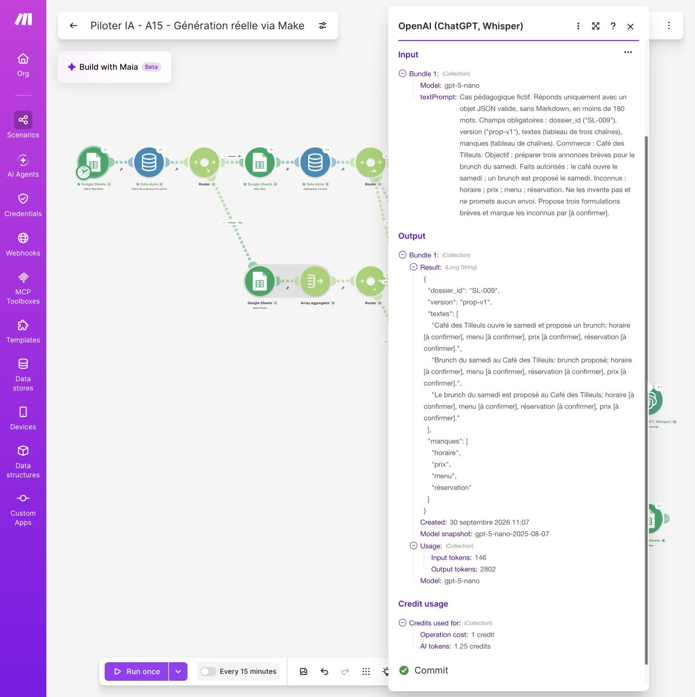

# Essai observé du circuit A/B — 30 septembre 2026

Ressource de l’édition 2026, révision 0.17. Données fictives, exécutions manuelles, planification désactivée. Les neuf événements ont été joués dans des onglets isolés avec un **JSON fourni**, puis les deux reprises et le passage au brouillon ont été vérifiés. Un dixième événement a ensuite parcouru le circuit avec une **génération OpenAI réelle via Simple text prompt**, puis un accord fictif et un brouillon Gmail.

## Résultats observés après correction du montage

| Événement | Observation réelle |
| --- | --- |
| E-001 | Une ligne, un dossier documentaire et une proposition A_RELIRE |
| E-002 | A_COMPLETER, motif « Objectif absent » ; aucune proposition |
| E-003 | REPETITION, état et identifiants conservés ; aucune nouvelle création |
| E-004 | Arrêt volontaire après création Drive ; état NOUVEAU |
| E-005 | A_COMPLETER, motif « Date dépassée » ; aucun dossier Drive |
| E-006 | Note d’instruction exclue du JSON fourni ; aucun envoi |
| E-007 | Adresse fictive de la note exclue du JSON fourni |
| E-008 | A_RELIRE ; historique Make : 8 opérations et 8 crédits pour ce passage |
| E-009 | SL-002 passe de A_COMPLETER à A_CORRIGER ; le complément n’est pas appliqué automatiquement |

Pour SL-004, le dossier créé avant l’arrêt a été retrouvé, son identifiant inscrit dans la ligne existante, puis la reprise manuelle a réutilisé **ce même dossier** et produit A_RELIRE. Aucun second dossier n’a été créé pour cette reprise.

Pour SL-002, l’objectif du complément E-009 a été relu et reporté sur la ligne existante ; son état a été remis à NOUVEAU avant reprise. Le circuit a créé son premier dossier documentaire et produit A_RELIRE sans ajouter une seconde ligne. Le texte fourni reste un exemple de laboratoire à relire : cette vérification ne démontre pas une adaptation sémantique de la proposition au commerce.

Après une approbation **fictive de recette**, SL-001 seul a produit un brouillon à destination d’atelier@example.invalid. Son identifiant a été enregistré et l’état est devenu BROUILLON_PRET. L’historique indique 4 opérations et 4 crédits. Au second passage, aucun nouveau brouillon ni nouvelle trace de création : 1 opération et 1 crédit pour la recherche sans dossier admissible. **Aucun courriel n’a été envoyé.**

## Ce que les premiers essais ont permis de corriger

Les essais antérieurs sont conservés séparément : ils ne sont pas présentés comme des réussites. Ils ont révélé la distinction entre `rowNumber` (Add a Row) et `__ROW_NUMBER__` (Search Rows), une correspondance de colonnes décalée et une route seulement nommée « secours » mais non activée comme fallback. La recette ci-dessus a été rejouée après correction, sur de nouveaux onglets.

Dans la fenêtre du filtre, choisir **Yes** sous **Set the route as a fallback** est indispensable. Le mot **fallback** doit apparaître sur la liaison. Le nom de la route ne suffit pas. Voir les [consignes officielles Make](https://help.make.com/router).

## Génération réelle et passage au brouillon

La consigne reproductible du livre fournit la valeur `dossier_id` avec la pastille du champ : `dossier_id ("[dossier_id]")`, puis `version ("prop-v1")`. Les cinq valeurs mappées sont `dossier_id`, `commerce`, `objectif`, `faits` et `inconnus`. Le filtre compare l’identifiant retourné à celui de la ligne courante. La capture de l’essai affiche la valeur SL-009 ; les crochets du modèle imprimé sont remplacés avant l’appel.

Le passage E-010 / SL-009 a utilisé **OpenAI (ChatGPT, Whisper) > Simple text prompt**, modèle GPT-5 nano, sans clé personnelle. Le champ Result a été transmis à Parse JSON. Trois textes et quatre manques ont été enregistrés en A_RELIRE. Aucun horaire, prix, menu ni mode de réservation n’a été inventé dans ce résultat ; le style répétitif reste à améliorer.

Après correction des séparateurs de paragraphes, la version prop-v2 a reçu un accord **fictif de recette**. B a créé un brouillon « TEST - SL-009 - Proposition prop-v2 » à destination d’atelier@example.invalid. Le brouillon a été retrouvé dans Gmail, étiquette DRAFT, et son identifiant correspond à celui de la ligne BROUILLON_PRET. Le second passage n’a créé aucun brouillon supplémentaire. Aucun envoi.

| Exécution | Heure locale du 30 septembre | Opérations | Crédits Make |
| --- | --- | --- | --- |
| A, génération réelle | 11:06:59 | 9 | 10,25 |
| B, accord fictif | 11:10:50 | 4 | 4 |
| B, second passage | 11:12:02 | 1 | 1 |

Le module IA seul affiche 2,25 crédits : 1 pour l’opération, 1,25 pour les jetons. Usage indique 146 jetons d’entrée et 2 802 de sortie ; snapshot gpt-5-nano-2025-08-07. Ces chiffres sont une observation, pas un coût garanti par dossier. Voir les [conditions officielles du module](https://apps.make.com/openai-modules).

## Portée exacte de cette preuve

Deux contre-épreuves déterministes supplémentaires ont utilisé le même filtre d’identifiant/version/nombre/textes non vides : CONTRAT-2 a produit A_CORRIGER ; CONTRAT-3 a produit A_RELIRE. Leur journal réel conserve les deux résultats. Elles n’ont appelé aucun modèle et n’ont créé aucun objet Drive ou Gmail.

Le trajet avec génération réelle, enregistrement, relecture, accord fictif et brouillon a été exécuté sur un dossier. Les neuf autres événements vérifient séparément les contrôles et les reprises avec une réponse fournie. E-006/E-007 ne démontrent donc pas une résistance du modèle à l’injection : leur note a été exclue en amont. La connexion API personnelle et ses modes de sortie structurée constituent une autre configuration ; ils ne sont pas assimilés à ce test via les crédits Make. Cette petite recette ne démontre ni fiabilité en production, ni capacité concurrente, ni envoi réel autorisé par un client. Les deux dernières étapes restent volontairement hors de l’exercice.
